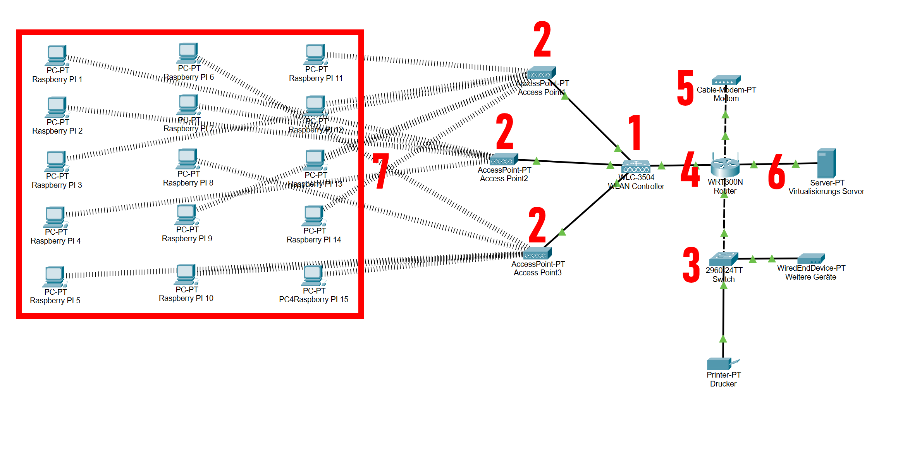

# Infrastrukturen an Schulen mit dem Raspberry PI
## Über unser Projekt:
Computer und sonstige elektrische Geräte sind in der heutigen Zeit in jeder Schule anzutreffen, aber auch in jedem grossen Unternehmen, was über viele Mitarbeiter verfügt. Sie sind alle praktisch und erleichtern unseren Alltag um einiges, doch leider sind sie auch nicht perfekt und bringen einige Nachteile mit sich.

Zum einen sind sie teuer, vor allem in grossen Mengen. Zum zweiten Verlieren sie schnell an Wert und dies ist dem heutigen technischen Fortschritt zu schulden. Das ist der Grund warum man in vielen Schulen und unternehmen noch viele alte Geräte findet und dies bringt einige Probleme mit.

Zum einen haben sie zu wenig Rechenleistung, um auf dem neuesten Betriebssystem zu laufen und verpassen daher wichtige Sicherheitsupdates und es besteht eine Hackerangriff-Gefahr. Zum anderen sind alte Geräte nicht so effizient wie heute und verbrauchen daher viel Strom, was zu höheren Energiekosten führt.

Unser Ziel ist es dieses Problem mit der alten Hardware so weit wie möglich zu minimieren und Energiekosten zu sparen und mit diesem Wettbewerb eine gewisse Reichweite zu erreichen und Leute mit unserer Idee zu überzeugen

## Gründe für das Projekt

Mit dem Lehrplan 21, welches in den letzten Jahren eingeführt wurde, braucht man immer mehr Computer an Schulen, damit Schüler in den Fächern Informatik und computerbezogene Freifächer unterrichtet werden können. Trotz den vielen Schul- / Mengenangeboten von Computerhersteller, kann das sehr grosse Kosten an Schulen / Gemeinden bringen. 

Da Prozessoren der ARM Architektur immer üblicher werden (z.B. das Porten von Windows 11 auf ARM oder die Apple Sillicon Computer, welche auf M1 Prozessoren laufen), haben wir uns gefragt, ob man diese «Architektur der Zukunft» auch an Schulen einführen kann. Wir kamen auf die Idee, All In-One PCs / Desktop PCs an Schulen mit den berühmten Raspberry Pi zu ersetzen. Spezifisch den Raspberry Pi Zero. 

Wenn man jeden Schüler ein Raspberry Pi geben würde, könnte man den Schüler Linux beibringen und für Schularbeit eine Client-Server Remote Desktop Verbindung benutzen, damit man auf Schulressourcen zugreifen kann. 

Mit diesem Projekt dokumentieren wir auf einer Webseite, was alles mit den Raspberry PI möglich ist und wie man so ein Netzwerk an einer Schule aufbaut. Das Hauptziel dieses Projektes ist aber herauszufinden, wieviel Strom, Kosten und Materialien gebaut werden.

## Energiesparung

Ein Laptop verwendet in der Regel nur halb so viel Energie und Platz wie ein "Eigenständiger PC". In einer grossen Schule würde das Ersetzen der Computer und Laptops durch sogenannte Raspberry Pi innerhalb viel Geld sparen. Normalerweise gibt es an grossen Schulen noch Computerräume, denn die Transition von PCs zu iPads und Laptops erfolgte nicht so lange her. Hier die Energiekosten innerhalb eines Jahres mit Raspberry Pi’s:

- ~11'000.- ohne Energiekosten (Leistung)

- 15'000.- mit Server Idle und wenig Gebrauch

- 19'000.- mit einem Server, der 24/7 unter Volllast läuft

Und hier derselbe Vergleich mit gewöhnlichen Computer

- ~21'275.- ohne Energiekosten (Leistung)

- 32'000.- mit Energiekosten

- 35'500.- mit Energiekosten Computer + Laptop

Mit unserem Projekt ermöglichen wir die Flexibilität verschiedene Betriebssysteme, die für die jeweiligen Zwecke angepasst sind, auf die Geräte zu installieren. Dies verbesserten den Workflow und das

Da jede Schule andere Bedürfnisse und Preferenzen hat, müssen diese auch beachtet werden, damit man das optimale Erlebnis für die Schüler schaffen kann. Aus diesem Grund gibt es diese Tabelle:

|           | Standard PC                                                              | Raspberry Pi                                                                                   |
|-----------|--------------------------------------------------------------------------|------------------------------------------------------------------------------------------------|
| Vorteile  | - Betriebssystem ist vorinstalliert   - Mehr Anschlüsse   - Leistungsstark | - All-in-one   - Günstiger   - Portabel   - Energieeffizient   - Bessere Lernerfahrung              |
| Nachteile | - Nicht portabel   - Aufrüstungen sind teurer   - Weniger Energieeffizient | - Weniger Anschlüsse   - Benötigt viel Zubehör   - Micro SD Karten als Speicher   - ARM Prozessor |

## Umsetzung

Die Umsetzung des Projekts kann sich etwas schwierig gestalten, da mehrere Raspberry Pi's auch nicht gerade günstig sind. Deswegen lohnt es sich mit einem Prototyp anzufangen und diesen für seine Bedürfnisse anzupassen für das optimale Lernerlebnis und dies kann man anschliessend auf die weiteren Raspberry Pi's übertragen.

Die Umsetzung in Form eines Prototypen bzw. mehrereren Prototypen könnte möglich sein, wenn sie in einem kleineren Rahmen, als in einer Primarklasse mit etwa zwanzig Schülern, erfolgt. Der Computer wäre nicht besonders leistungsfähig und es gäbe nur etwa drei Rasperry Pi, Monitore, Peripheriegeräte und die notwendige Verkabelung.

Die Topologie oder auch das Rechennetz wird als Stern-Topologie durchgehen, da mit einem zentralen Server gearbeitet wird. Die Stern-Topologie ist inzwischen die verbreiteteste Verkabelungstopologie.

